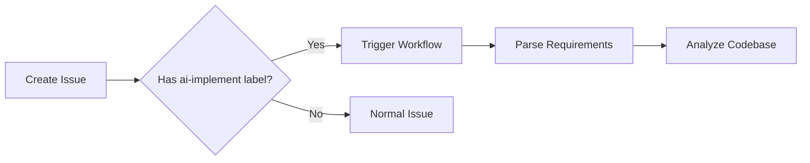
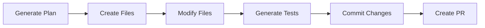
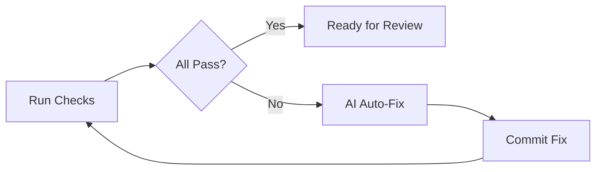

# 🤖 AI-Driven Development Workflow - Complete Implementation Guide

This document provides a complete overview of the AI-driven development workflow system that has been set up for your React + Firebase project.

## 📚 Table of Contents

1. [Overview](#overview)
2. [What Has Been Created](#what-has-been-created)
3. [How It Works](#how-it-works)
4. [Setup Instructions](#setup-instructions)
5. [Usage Guide](#usage-guide)
6. [File Structure](#file-structure)
7. [Customization](#customization)
8. [Next Steps](#next-steps)

## Overview

This system automates your entire development workflow from issue creation to deployment:

```
GitHub Issue → AI Analysis → Code Generation → Tests → PR → Auto-Fix → Merge
```

**Key Features:**

- ✅ Automatic code implementation from issues
- ✅ AI-generated unit and E2E tests
- ✅ Automated PR creation
- ✅ CI/CD with linting, type checking, and testing
- ✅ Auto-fix for failing tests
- ✅ Iterative improvement until all checks pass

## What Has Been Created

### GitHub Actions Workflows

1. **`.github/workflows/issue-to-pr.yml`**

   - Triggers: When issue is created/labeled with `ai-implement`
   - Actions: Creates branch, implements code, generates tests, creates PR

2. **`.github/workflows/pr-checks.yml`**
   - Triggers: When PR is opened/updated
   - Actions: Runs linting, type checking, build, E2E tests, auto-fixes failures

### AI Scripts

1. **`.github/scripts/ai-implement.js`**

   - AI-powered code implementation
   - Analyzes issue requirements
   - Generates React/TypeScript code
   - Creates new components and features

2. **`.github/scripts/generate-tests.js`**

   - Generates unit tests (Vitest)
   - Generates E2E tests (Playwright)
   - Creates test scenarios based on implementation

3. **`.github/scripts/ai-autofix.js`**
   - Automatically fixes linting errors
   - Resolves type errors
   - Fixes build issues
   - Addresses test failures

### Test Setup

1. **`playwright.config.ts`** - Playwright E2E configuration
2. **`vitest.config.ts`** - Vitest unit test configuration
3. **`tests/setup.ts`** - Test environment setup
4. **`tests/e2e/example.spec.ts`** - Example E2E test
5. **`tests/unit/App.test.tsx`** - Example unit test

### Issue Templates

1. **`.github/ISSUE_TEMPLATE/ai-feature-request.md`**

   - Template for requesting new features
   - Includes acceptance criteria and technical details

2. **`.github/ISSUE_TEMPLATE/ai-bug-report.md`**
   - Template for reporting bugs
   - Includes reproduction steps and environment details

### Documentation

1. **`AI_WORKFLOW.md`** - Complete workflow documentation
2. **`QUICKSTART.md`** - Quick start guide
3. **`ADVANCED_AI_SETUP.md`** - Advanced configuration guide
4. **`.github/workflows/README.md`** - Workflow-specific documentation

### Configuration Files

1. **`.env.example`** - Environment variable template
2. **`.vscode/settings.json`** - VS Code settings
3. **`.vscode/extensions.json`** - Recommended extensions
4. **`setup-ai-workflow.sh`** - Automated setup script

## How It Works

### Phase 1: Issue Creation & Analysis



### Phase 2: Implementation



### Phase 3: Testing & Auto-Fix



## Setup Instructions

### Quick Setup (5 minutes)

```bash
# 1. Run automated setup
chmod +x setup-ai-workflow.sh
./setup-ai-workflow.sh

# 2. Configure environment
cp .env.example .env
# Edit .env with your API keys (optional)

# 3. Test the setup
npm run test:unit
npm run test:e2e
```

### GitHub Configuration

#### 1. Enable GitHub Actions

1. Go to **Settings** → **Actions** → **General**
2. Under "Workflow permissions":
   - ✅ Select "Read and write permissions"
   - ✅ Check "Allow GitHub Actions to create and approve pull requests"

#### 2. Create Labels

Go to **Settings** → **Labels** and create:

| Label              | Color   | Description                |
| ------------------ | ------- | -------------------------- |
| `ai-implement`     | #0E8A16 | Triggers AI implementation |
| `ai-generated`     | #1D76DB | Marks AI-generated PRs     |
| `automated`        | #FBCA04 | Marks automated workflows  |
| `ready-for-review` | #0E8A16 | Ready for human review     |

#### 3. Add Secrets (Optional)

Go to **Settings** → **Secrets and variables** → **Actions**

Add optional secrets for enhanced AI:

- `OPENAI_API_KEY` - For GPT-4 integration
- `ANTHROPIC_API_KEY` - For Claude integration

> **Note:** The workflow works without these, but AI features are more powerful with them.

#### 4. Branch Protection (Recommended)

1. Go to **Settings** → **Branches**
2. Add rule for `main` branch:
   - ✅ Require a pull request before merging
   - ✅ Require status checks to pass before merging
   - ✅ Require branches to be up to date before merging

## Usage Guide

### Creating a Feature Request

1. **Navigate to Issues** → **New Issue**
2. **Select "🤖 AI Feature Request"**
3. **Fill in details**:

   ```markdown
   Title: Add dark mode toggle button

   Description:
   Implement a dark mode toggle in the header that persists user preference.

   Requirements:

   - Toggle button with sun/moon icon
   - Persist to localStorage
   - Apply theme to all components

   Acceptance Criteria:

   - [ ] Button renders in header
   - [ ] Clicking toggles theme
   - [ ] Theme persists on reload
   ```

4. **Add label**: `ai-implement`
5. **Submit issue**

### What Happens Next

1. **Within seconds**: Workflow starts
2. **~2-5 minutes**: Branch created, code implemented
3. **~1-2 minutes**: Tests generated
4. **~30 seconds**: PR created
5. **~2-3 minutes**: CI/CD runs
6. **If failures**: Auto-fix runs (repeat until green)
7. **When green**: Comment added "Ready for review"

### Reviewing the PR

1. Go to **Pull Requests** tab
2. Find PR titled "🤖 AI: [Your issue title]"
3. Review:
   - Code changes
   - Generated tests
   - CI/CD results
4. If satisfied → **Merge**
5. If changes needed → Comment with requests

## File Structure

```
followup-v2/
├── .github/
│   ├── workflows/
│   │   ├── issue-to-pr.yml          # Main AI workflow
│   │   ├── pr-checks.yml            # CI/CD + Auto-fix
│   │   └── README.md                # Workflow docs
│   ├── scripts/
│   │   ├── ai-implement.js          # Code generator
│   │   ├── generate-tests.js        # Test generator
│   │   └── ai-autofix.js            # Auto-fix engine
│   └── ISSUE_TEMPLATE/
│       ├── ai-feature-request.md    # Feature template
│       └── ai-bug-report.md         # Bug template
│
├── tests/
│   ├── e2e/                         # Playwright tests
│   │   └── example.spec.ts
│   ├── unit/                        # Vitest tests
│   │   └── App.test.tsx
│   └── setup.ts                     # Test config
│
├── .vscode/
│   ├── settings.json                # Editor settings
│   └── extensions.json              # Recommended extensions
│
├── playwright.config.ts             # Playwright config
├── vitest.config.ts                 # Vitest config
├── setup-ai-workflow.sh             # Setup script
├── .env.example                     # Environment template
│
├── AI_WORKFLOW.md                   # Full documentation
├── QUICKSTART.md                    # Quick guide
├── ADVANCED_AI_SETUP.md             # Advanced features
└── IMPLEMENTATION.md                # This file
```

## Customization

### Modifying AI Behavior

**Edit `.github/scripts/ai-implement.js`**:

```javascript
// Change component template
generateComponentTemplate(name) {
  // Your custom template
}

// Modify file naming
kebabCase(str) {
  // Your naming convention
}
```

### Adjusting Tests

**Edit `.github/scripts/generate-tests.js`**:

```javascript
// Add more test scenarios
async generateUnitTest(filePath) {
  // Your test template
}
```

### Customizing Workflows

**Edit `.github/workflows/pr-checks.yml`**:

```yaml
# Add more checks
- name: Custom Check
  run: npm run custom-check
```

### Integrating Real AI APIs

See **`ADVANCED_AI_SETUP.md`** for:

- OpenAI GPT-4 integration
- Anthropic Claude integration
- Custom AI providers
- MCP server setup

## Next Steps

### Immediate Actions

1. ✅ Run setup script: `./setup-ai-workflow.sh`
2. ✅ Configure GitHub settings
3. ✅ Create labels
4. ✅ Test with a simple issue

### Short-term (This Week)

1. Test workflow with simple features
2. Review generated code quality
3. Fine-tune templates and prompts
4. Train team on usage

### Medium-term (This Month)

1. Integrate real AI APIs (OpenAI/Anthropic)
2. Enhance code generation quality
3. Add more sophisticated tests
4. Set up monitoring/analytics

### Long-term (This Quarter)

1. Implement MCP server integration
2. Add visual regression testing
3. Set up automated deployment
4. Create feedback loop for AI improvement

## Troubleshooting

### Workflow Not Triggering

**Problem**: Issue created but no workflow runs

**Solutions**:

1. Verify `ai-implement` label exists
2. Check GitHub Actions is enabled
3. Review workflow permissions
4. Check Actions tab for errors

### Tests Failing

**Problem**: PR checks keep failing

**Solutions**:

1. Review error logs in Actions tab
2. Run tests locally: `npm test`
3. Check auto-fix script logs
4. Manual intervention may be needed

### Scripts Not Executable

**Problem**: Permission denied when running scripts

**Solution**:

```bash
chmod +x .github/scripts/*.js
chmod +x setup-ai-workflow.sh
```

## Cost Considerations

### Without AI API Keys (Free)

- ✅ Full workflow automation
- ✅ Template-based code generation
- ✅ Pattern-based auto-fix
- ✅ All CI/CD features
- ❌ Limited AI intelligence

### With AI API Keys (Paid)

- ✅ All free features
- ✅ Intelligent code generation
- ✅ Context-aware implementations
- ✅ Smart auto-fix
- 💰 ~$0.01-$0.10 per issue (GPT-4)

## Security & Best Practices

### ✅ Do's

- ✅ Always review AI-generated code
- ✅ Use branch protection rules
- ✅ Keep API keys in GitHub Secrets
- ✅ Start with simple issues
- ✅ Monitor workflow costs
- ✅ Regular security audits

### ❌ Don'ts

- ❌ Don't commit API keys
- ❌ Don't blindly merge PRs
- ❌ Don't skip code reviews
- ❌ Don't use on critical production code without review
- ❌ Don't ignore security warnings

## Support & Resources

### Documentation

- [AI_WORKFLOW.md](./AI_WORKFLOW.md) - Full documentation
- [QUICKSTART.md](./QUICKSTART.md) - Quick start
- [ADVANCED_AI_SETUP.md](./ADVANCED_AI_SETUP.md) - Advanced setup

### External Resources

- [GitHub Actions Docs](https://docs.github.com/en/actions)
- [Playwright Docs](https://playwright.dev)
- [Vitest Docs](https://vitest.dev)
- [OpenAI API](https://platform.openai.com/docs)

### Getting Help

1. Check documentation files
2. Review workflow logs
3. Test locally
4. Check GitHub Discussions
5. Create an issue (without `ai-implement` label!)

## Success Metrics

Track these to measure workflow effectiveness:

- **Time saved**: Issue creation to merge time
- **Code quality**: Passing rate on first attempt
- **Test coverage**: Automated test generation quality
- **Fix rate**: Percentage of auto-fixed issues
- **Developer satisfaction**: Team feedback

## Conclusion

You now have a complete AI-driven development workflow! 🎉

**What you can do:**

1. Create GitHub issues
2. Add `ai-implement` label
3. Wait for AI to build it
4. Review and merge

**What the AI does:**

1. Analyzes requirements
2. Generates code
3. Creates tests
4. Runs checks
5. Fixes issues
6. Notifies when ready

Start by creating a simple feature request and watch the magic happen!

---

**Questions? Issues? Improvements?**

Create an issue (without the `ai-implement` label) and let's discuss! 💬

**Happy Automating! 🚀🤖**
